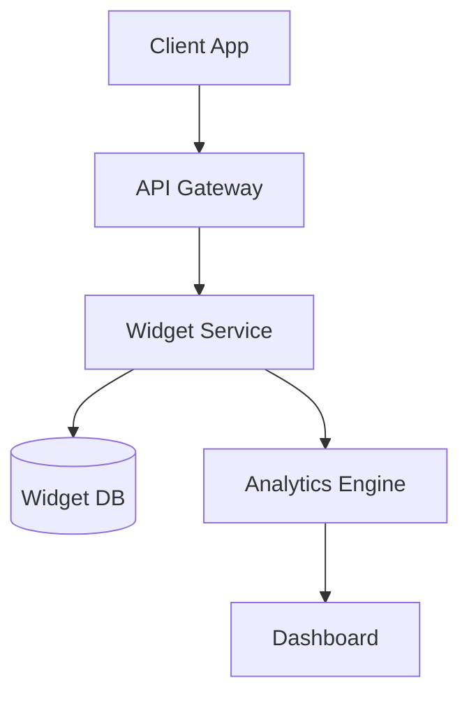

# Executive Summary

This is a sample investment memo demonstrating the memo rendering system. In production, memos are fetched from a private GitHub repository.

## Investment Thesis

Acme Corp represents a compelling opportunity in the enterprise software space:

- **Strong market position** in a growing sector
- **Experienced team** with deep domain expertise
- **Proven technology** with clear differentiation
- **Clear path to profitability** with healthy unit economics

## Company Overview

Founded in 2020, Acme Corp has quickly established itself as a leader in enterprise widget management. The company serves over 200 enterprise customers across North America and Europe.

### Key Metrics

| Metric | Value |
|--------|-------|
| ARR | $12M |
| Growth Rate | 150% YoY |
| Net Revenue Retention | 135% |
| Gross Margin | 78% |

## Market Opportunity

The enterprise widget management market is projected to grow from $5B to $15B by 2028, representing a **25% CAGR**.

> "Widget management is becoming critical infrastructure for modern enterprises." - Industry Analyst

### Code Example

Here's how the API integration works:

```typescript
import { WidgetManager } from '@acme/sdk';

const manager = new WidgetManager({
  apiKey: process.env.ACME_API_KEY,
  region: 'us-west-2',
});

// Fetch all active widgets
const widgets = await manager.list({ status: 'active' });
console.log(`Found ${widgets.length} active widgets`);
```

### Architecture Diagram



## Risks and Mitigations

1. **Competition from incumbents** - Mitigated by superior technology and customer focus
2. **Market timing** - Strong early traction validates timing
3. **Execution risk** - Experienced leadership team

## Conclusion

We recommend proceeding with this investment based on:

- Strong fundamentals
- Attractive valuation
- Significant growth potential

---

*This document is confidential and intended solely for authorized viewers.*
